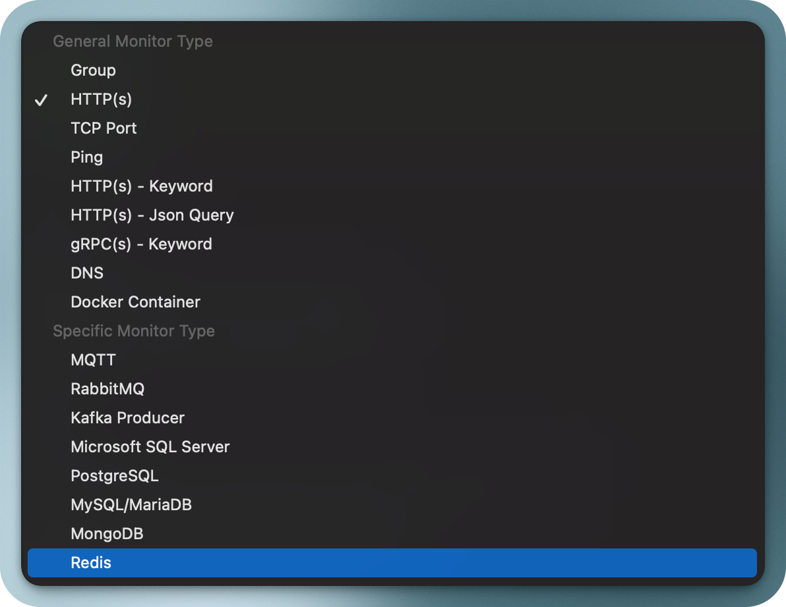
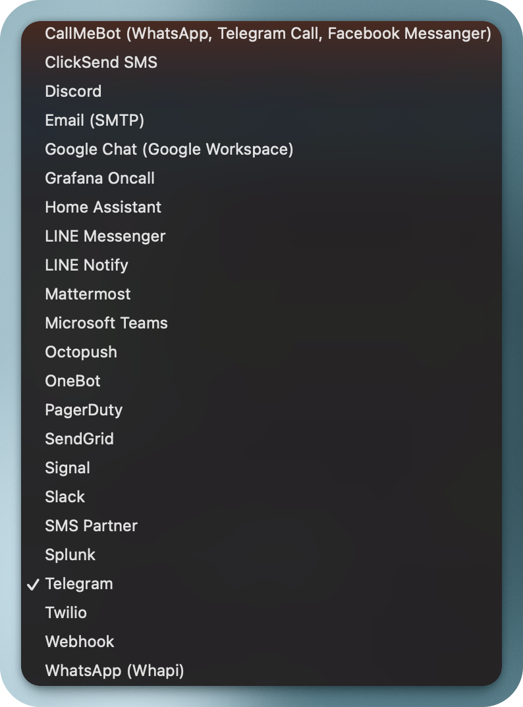

# PledgeQA SaaS: The One-Stop Solution for Uptime Monitoring

PledgeQA is a comprehensive uptime monitoring software designed to empower organizations with real-time insights into their systems' health and performance. With a wide range of monitoring options, alerting capabilities, and customizable features, PledgeQA ensures your systems stay reliable and your users stay happy. Whether you choose to host on your own tenant or opt for our managed version, PledgeQA is the ultimate solution for all your uptime monitoring needs.

## Key Features

### 1. **Comprehensive Monitors**

PledgeQA supports an extensive variety of monitors to cover all aspects of your systems:

- **HTTP(s):** Monitor websites and APIs for availability and performance.
- **TCP Port:** Verify port availability for critical services.
- **Ping:** Ensure network connectivity and responsiveness.
- **HTTP(s) - Keyword:** Check for specific keywords in responses.
- **HTTP(s) - JSON Query:** Validate specific JSON properties in API responses.
- **gRPC(s) - Keyword:** Ensure the presence of keywords in gRPC responses.
- **DNS:** Monitor DNS records for accuracy and changes.
- **Docker Container:** Track the health of Docker containers.
- **RabbitMQ:** Monitor RabbitMQ queues for availability.
- **Kafka Producer:** Ensure Kafka producers are functioning as expected.
- **Databases:** Monitor popular databases, including:
  - Microsoft SQL Server
  - PostgreSQL
  - MySQL/MariaDB
  - MongoDB
  - Redis

With these options, PledgeQA can monitor everything from basic website uptime to complex infrastructure components.

---

### 2. **Group Monitors Together**

Organize related monitors into **groups** for better visualization and streamlined management. For example, group all components of a microservice or a geographical region for a clearer status overview.

---

### 3. **Status Pages**

Display monitor statuses in real-time with customizable **status pages**:

- Show individual monitor statuses.
- Group monitors for organized presentation.
- Enhance transparency with public-facing or internal status pages.
- Customize status pages with your branding for a seamless user experience.

---

### 4. **Advanced Configuration Options**

PledgeQA allows for extensive customization to suit unique monitoring requirements:

- Specify **maximum response time** to define acceptable performance thresholds.
- Set custom **headers**, **body**, **auth**, and expected **response statuses** for nuanced checks.
- Tailor monitoring to reflect your systems' specific operational needs.

---

### 5. **Maintenance Scheduling**

Easily schedule maintenance periods to pause monitoring during planned downtime. Prevent unnecessary alerts and maintain accurate uptime statistics.

---

### 6. **Alerts Across Multiple Platforms**

Stay informed with robust alerting capabilities integrated into popular tools and platforms:

- **SMS:** ClickSend SMS, SMS Partner, Twilio
- **Messaging Apps:** Discord, Google Chat (Workspace), LINE Messenger, LINE Notify, Mattermost, Signal, Slack, Telegram, WhatsApp (Whapi)
- **Email:** SMTP, SendGrid
- **Incident Management Tools:** Grafana Oncall, PagerDuty
- **Other Platforms:** Home Assistant, Microsoft Teams, Octopush, Splunk, Webhook

No matter where you are, PledgeQA ensures you receive alerts promptly and reliably.

---

### 7. **Customizable Settings**

Tailor PledgeQA to meet your organization's unique needs with configurable settings:

- **Timezone:** Align monitoring and reporting with your preferred timezone.
- **Search Engine Visibility:** Manage public status page SEO preferences.
- **Timeout for Errors:** Define acceptable response times before triggering alerts.
- **Data Retention:** Control the storage duration of historical monitoring data.
- **TLS Certification Expiry Notification:** Stay ahead of expiring SSL/TLS certificates.
- **Multiuser Login & 2FA:** Enable secure access for your team.
- **API Support:** Integrate monitoring with your applications.
- **Proxies:** Configure proxy settings for secure and private monitoring.

---

## Deployment Options

PledgeQA offers flexibility in deployment to suit various operational needs:

- **Self-Hosted:** Deploy PledgeQA docker image on your organization's own tenant for full control.
- **Assisted Deployment:** Get assistance with setting up PledgeQA on your infrastructure.
- **Managed Service:** Use our managed version for hassle-free setup and maintenance.

---

## Widely Used Features

While every feature in PledgeQA adds value, the following stand out as game-changers:

1. **Comprehensive Monitors:** Supports an unmatched range of monitoring types.
2. **Status Pages:** Enhance transparency and trust with customizable public pages.
3. **Alerts Across Multiple Platforms:** Seamless integration with over 20 alerting platforms.
4. **Maintenance Scheduling:** Simplifies downtime management.
5. **TLS Certificate Expiry Notifications:** Prevent costly SSL/TLS certificate lapses.

---

## Why Choose PledgeQA?

PledgeQA stands out for its flexibility, scalability, and ease of use. By consolidating all uptime monitoring needs into a single platform, it minimizes complexity and maximizes efficiency for IT teams and businesses.

Whether you’re monitoring a simple website or a sophisticated infrastructure, PledgeQA is your trusted partner in ensuring uptime and reliability.
